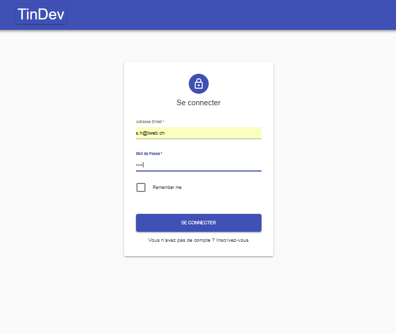
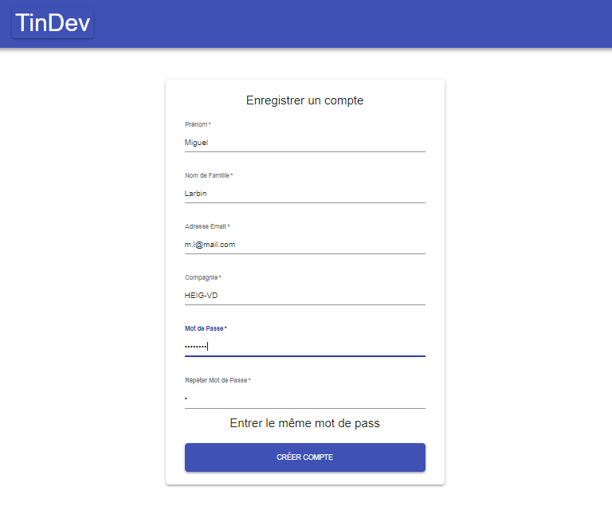
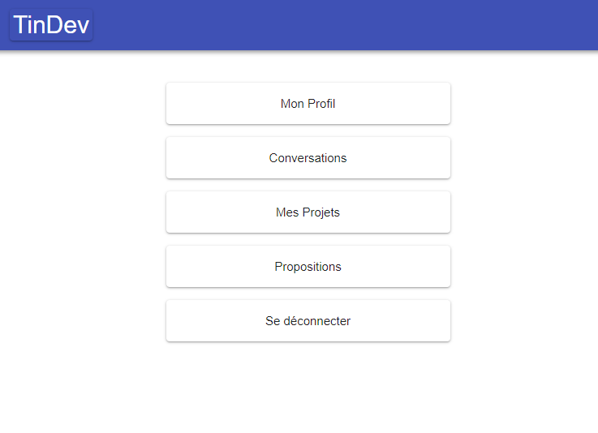
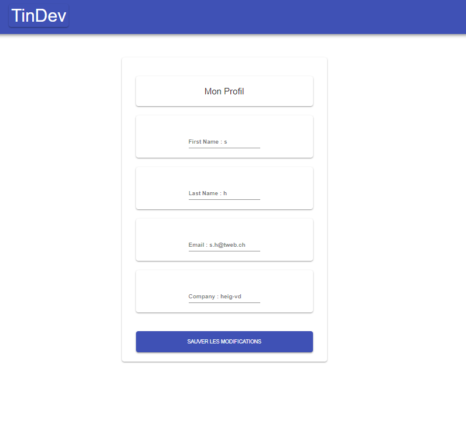
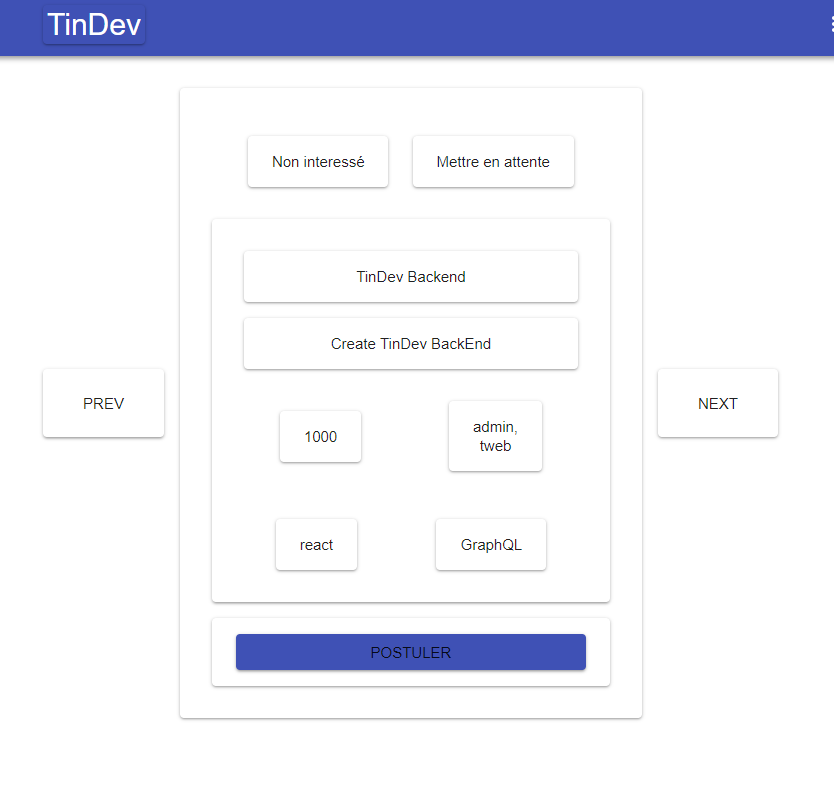
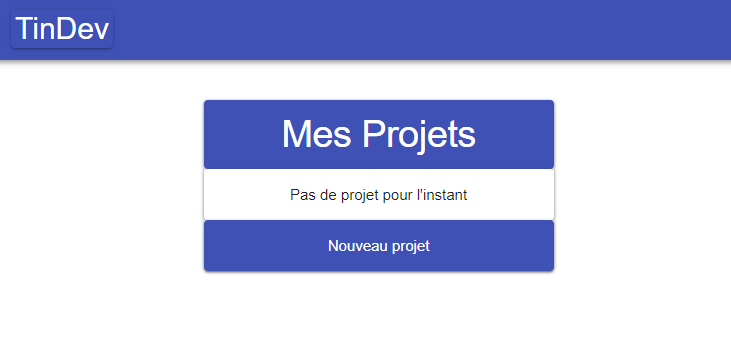
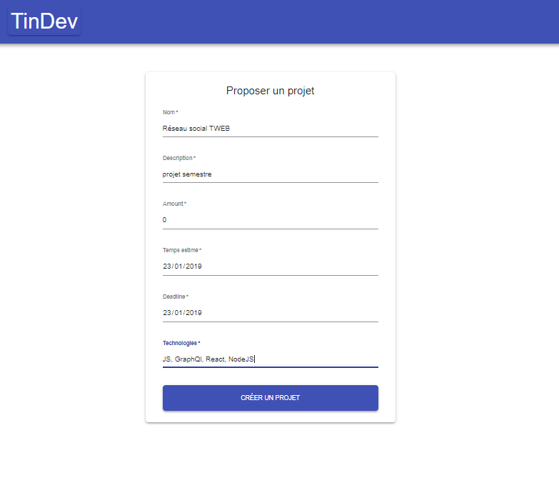
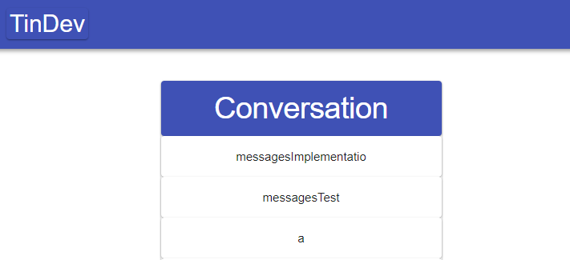
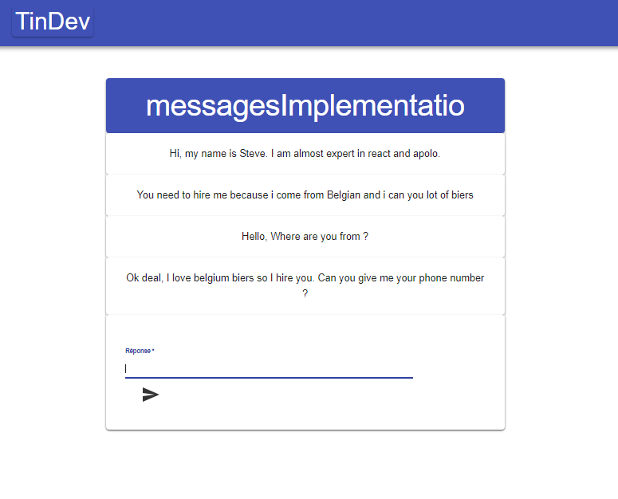

# TinDev - Projet TWEB 2019

Auteurs: Besseau Thibaud, Henriquet Steve, Schürch Loïc

## TinDev

TinDev est une plateforme de proposition de projet pour développeur.

Elle propose à tout utilisateur de mettre en ligne une proposition de projet. Tous les autres utilisateurs pourront voir la proposition et engager la conversation.

Un utilisateur peut modifier son profil et a accès aux conversations liées aux projets auxquels il a postulé.

Un projet sera accompagné d'une description,

## Utilisation en local

Ce projet contient deux applications séparé

- `/client` - Un projet React pour le Front-end

- `/api` - Une API expressJS pour le Back-end


### Set up local

1. Installer les dépendances nécéssaire avec les commandes suivantes:

  ```
cd ./api && npm install
cd ./client && npm install
```

2. Il faut aussi définir les variables d'environnement dans le fichier `.env `.

### Execution en local

1. Démarrer les applications avec les commandes:

  ```
cd ./api && npm dev
cd ./client && npm start
```

2. Ouvrez votre browser préféré pour vous diriger vers le lien `http://localhost:3000`


## Utilisation en ligne

L'adresse de TinDev est `https://tindevclient.herokuapp.com/`.

A noter que certaines pages ne semble pas fonctionner sous `Firefox`. Il est préférable d'utiliser `Google Chrome`.

## Utilisation de TinDev

Connexion: Entrer l'adresse mail et le mot de passe



Enregistrer un compte: Entrer les informations pour tous les champs. Vous devez entrer deux fois le même mot de passe



Menu principal: page d'acceuil



Profil: Les valeurs actuelles sont affichés, vous avez la possibilité de les modifier et de sauver les modifications



Propositions: Ici vous pouvez voir tous les projets proposés par d'autre utilisateur. Leur nom, description, valeur, créateur et technologies nécéssaires sont affichées

Il est possible d'accéder aux projets suivants ou précédents avec les boutons "NEXT" et "PREV"

Le bouton "POSTULER" permet de vous mettre en contact avec le créateur.



Mes projets: Accédez à la liste de vos projets et à la création de nouveaux projets



Création de projet: Il est possible de proposer un nouveau projet en remplissant les champs:



Conversation: Vous pouvez accéder aux conversations liées aux projets qui vous intéressent, il suffit de cliquer dessus



Et de communiquer avec le créateur:



## Choix des technologies

* React pour la partie front-end. Celle-ci permet une bonne modularité avec la possibilité de créer des composants.

* GraphQL, NodeJS et Express session pour le back-end

* Heroku et Now pour le déploiement

## API

## requêtes et données

## Déploiement

Nous avons utiliser Heroku pour déployer le front-end et Now pour le back-end. Atlas est utiliser pour héberger la base de données

## auto-évaluation

Un grand manque de finition à cause d'un manque de temps. Les fonctionalités sont implémentées mais des bugs sont toujours présents

## Tests
